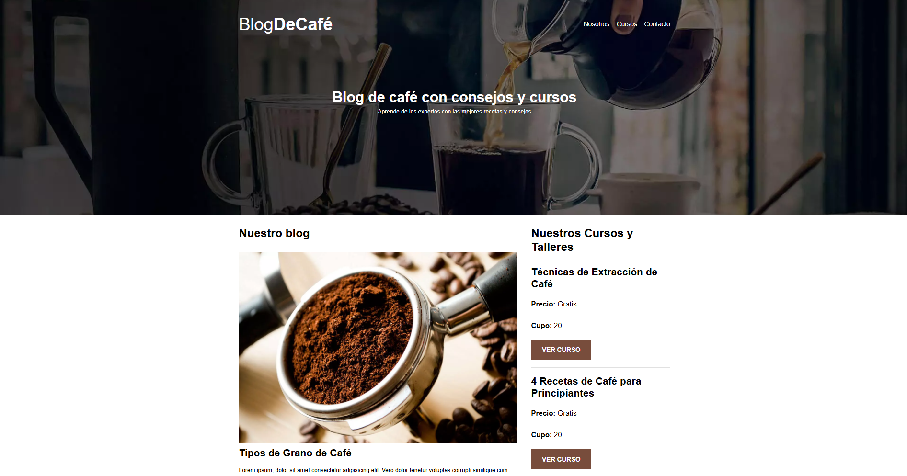
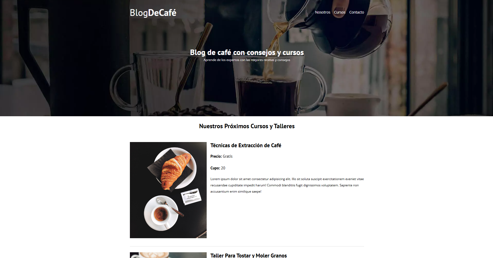
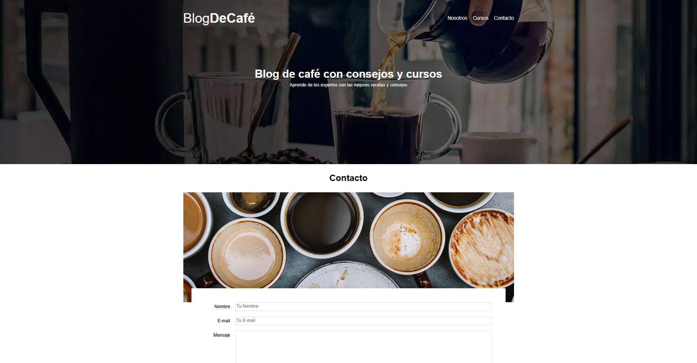

# BlogDeCafé

Sitio web estático para un blog de café con información sobre cursos, recetas y contacto. Proyecto enfocado en HTML5, CSS3, diseño responsive y buenas prácticas de maquetación.

**Demo:** https://nqingcafe.netlify.app/

## Vista previa

### Página principal

### Página de cursos ofertados

### Página de contacto

### Página principal en móvil

## Características

- Diseño totalmente responsive
- Maquetación con Flexbox y Grid
- Blog con entradas dinámicas (estructura)
- Página de cursos
- Página de contacto con formulario
- Optimización con normalize.css, preload y prefetch
- Imágenes en .webp y .jpg para mejorar performance.
- Efectos hover y animaciones suaves

## Tecnologías
- HTML5
- CSS3 (Flexbox, Grid)
- Modernizr
- Responsive Design